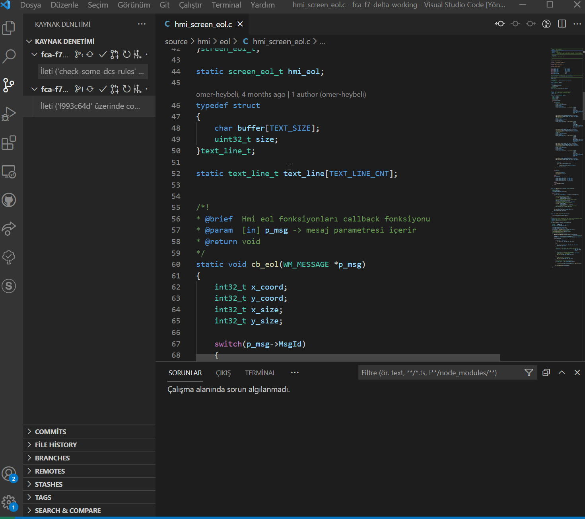

# Hamsi

## Nedir?

Hamsi, bazı DCS kurallarını içeren biçimsel analiz aracıdır. Hamsinin incelediği kurallar "DCS-1.3, DCS-3.1, DCS-3.2, DCS-3.3, DCS-3.4, DCS-3.5, DCS-4.3, DCS-4.4, DCS-4.5, DCS-4.6, DCS-4.7, DCS-5.1, DCS-6.2, DCS-7.2" kurallarıdır. 

## Komut satırı kullanımı

Hamsi, bir parametre almaktadır. Parametre olarak analiz edilecek dosyanın ismi dosya yoluyla birlikte verilir. Örneğin:

```
hamsi.exe TestFiles/test.c
```

## VS Code üzerinden kullanımı

Kullanım kolaylığı için projenin task.json dosyasına görev eklenmiştir. Analiz edilmesi istenen dosya VS Code'da aktif dosya olduktan sonra "Terminal -> Run Task" işleminden sonra "Check Some DCS Rules with Hamsi" yazısına tıklanması yeterlidir. Kullanım şekli aşağıdaki gifte gösterilmiştir.



## Kurallar

DCS-1.3: Each parameter check shall be "performed with a different if statement.
```c
// Valid Examples
bool my_function(int32_t first, uint32_t *p_second)
{
    if (NULL == p_second)
    {
        return false;
    }

    if ((0 > first) || (10 < first))
    {
        return false;
    }

    // Business logic ...

    return true;
}
// Invalid Examples
bool my_function(int32_t first, uint32_t *p_second)
{
    if ((NULL == p_second) || (0 > first) || (10 < first))
    {
        return false;
    }

    // Business logic ...

    return true;
}
```

DCS-3.1: A ternary operator expression shall be divided into 3 lines if the expression exceeds the 80 char limit. Each operand shall be placed into a separate line. Operators shall be placed at the beginning of the last 2 lines. Operators shall be aligned with the beginning of the ternary expression.
```c
// Valid Examples
/******************************* 80 chars *************************************/

expt_t excpt = ((status & (1u << DIV_BY_ZERO_BIT_POS)) != 0u)
               ? OSAL_EXCPT_ERR_DIV_BY_ZERO
               : OSAL_EXCPT_ERR_NONE;
// Invalid Examples
/******************************* 80 chars *************************************/

expt_t excpt = ((status & (1u << DIV_BY_ZERO_BIT_POS)) != 0u) ? 
               OSAL_EXCPT_ERR_DIV_BY_ZERO : 
               OSAL_EXCPT_ERR_NONE;

expt_t excpt = (status && error && flag) ? OSAL_EXCPT_ERR_DIV_BY_ZERO 
               : OSAL_EXCPT_ERR_NONE;

expt_t excpt = ((status & (1u << DIV_BY_ZERO_BIT_POS)) != 0u)
        ? OSAL_EXCPT_ERR_DIV_BY_ZERO
        : OSAL_EXCPT_ERR_NONE;
```

DCS-3.2: Each function parameter shall be in a separate line and shall be aligned with the first parameter if the function signature exceeds the 80 char limit. The first parameter shall be in the same line with the function name if it fits in 80 chars.
```c
// Valid Examples
/******************************* 80 chars *************************************/

static os_index_t osal_obj_get_idx_from_token_example_function(uint8_t param1,
                                                               uint8_t param2,
                                                               uint8_t param3);

static os_index_t osal_obj_get_idx_from_token_example_function_with_long_name(
    uint8_t param1,
    uint8_t param2,
    uint8_t param3);

osal_t osal_obj_get_from_token(uint8_t param1, uint8_t param2);

// Invalid Examples
/******************************* 80 chars *************************************/

static osal_index_t osal_obj_get_idx_from_token_example_foo(uint8_t param1, 
uint8_t param2);

osal_t osal_obj_get_from_token(uint8_t param1, 
                               uint8_t param2);
```

DCS-3.3: When switching to a new line; the “=” operator shall be placed in the first line and the second line shall be indented 4 spaces after the starting point of the first line.
```c
// Valid Examples
/******************************* 80 chars *************************************/

void my_func(uint32_t my_very_long_param)
{
    uint8_t b_my_very_long_bool_varaible =
        my_very_long_init_function(my_very_long_param);
}

// Invalid Examples
/******************************* 80 chars *************************************/

void my_func(uint32_t my_very_long_param)
{
    uint8_t b_my_very_long_bool_varaible 
        = my_very_long_init_function(my_very_long_param);
}

```

DCS-3.4: When dividing an expression into multiple lines; each operand shall be placed in a new line and operators shall be placed at the end of each line. Each line shall be aligned with the first operand.
```c
// Valid Examples
uint32_t my_very_long_variable = my_very_long_left_operand +
                                 my_very_long_right_operand;
                                 
uint32_t my_very_long_variable = my_very_long_left_operand +
                                 my_very_long_right_operand +
                                 (my_left_operand + my_right_operand);
// Invalid Examples
uint32_t my_very_long_variable = my_very_long_left_operand 
                                 + my_very_long_right_operand; // Wrong operator place.

uint32_t my_very_long_variable = my_very_long_left_operand + 
    my_very_long_right_operand; // Wrong alignment.

uint32_t my_very_long_variable = my_very_long_left_operand + my_operand +
                                 my_very_long_right_operand; // 2 operands in same line.

```

DCS-3.5: When switching to a new line in an if statement; each line shall contain only one expression and the logical operators shall be at the end of each line. Each line shall be aligned to the right of the opening “(“ of the if statement.
```c
// Valid Examples
if ((true == b_my_variable) &&
    (3 > my_variable) &&
    (true == my_get_function()))
{
    // ..
}
// Invalid Examples
if ((true == b_my_variable) 
    && (3 > my_variable) && // Wrong operator placement.
       (true == my_get_function())) // Wrong alignment.
{
    // ..
}
```

DCS-4.3: The first and last lines of a block shall not be blank.
```c
// Valid Examples
if (false == b_my_var)
{
    b_my_var = true;
}
// Invalid Examples
// Empty first line.
if (false == b_my_var)
{

    b_my_var = true;
}

// Empty last line.
if (false == b_my_var)
{
    b_my_var = true;

}

// Empty last line.
if (false == b_my_var)
{
    if (false == b_my_var)
    {
        b_my_var = true;
    }

}
```

DCS-4.4: An empty line shall be placed before and after “case:”, “default:”, and “break;” keywords in a switch statement.
```c
// Valid Examples
switch (my_var)
{
case 1:

    // ...

    break;

default:

    // ...
    
    break;
}

// Invalid Examples
switch (my_var)
{

case 1: // First line of a block cannot be an empty line.

    // ...
    break; // No empty line before the break.

case 2: // No empty line after case.
    // ...

    break; // No empty line after the break.
default:

    // ...
    
    break;

} // Last line of a block cannot be an empty line.
```

DCS-4.5: The last element of an enum definition shall end with a comma followed by a blank line.
```c
// Valid Examples
typedef enum my_enum_e
{
    A,
    B,
    C,

} my_enum_t;
```

DCS-4.6: There shall be a blank line after the last variable of a struct.
```c
// Valid Examples
typedef struct my_struct_s
{
    int a;
    int b;

} my_struct_t;
```

DCS-4.7: The opening “{“ symbol of an variable definition shall be placed after the “=” sign at the same line followed by a blank line. There shall be no blank line before the closing “}” symbol.
```c
// Valid Examples
int array[3] = {

    1,
    2,
};
```

DCS-5.1: The last element of an variable definition as example DCS-4.7 shall be followed by a comma if elements are placed in new lines.
```c
// Valid Examples
int array[3] = {

    1,
    2,
};

VarType var = {

    45,
    23,
};

int array[3] = {1, 2, 3};
```

DCS-6.2: All standard library headers shall be included with <> syntax. Other headers shall be included with “” syntax.
```c
// Valid Examples
#include "my_module.h"

#include <stdint.h>
```

DCS-7.2: // commenting shall be used instead of /**/ style even with multi line comments.

## Taşınabilirlik ve Bağımlılık

Hamsi C++ dilinin C++17 standardıyla yazılmıştır. Standart kütüphaneler dışında sadece Clang kütüphanesi kullanılmaktadır. Derleyici olarak Clang şart değildir. Windows işletim sisteminde Msys2 ortamında Mingw64 projesi için 32 bitlik kurulum aşağıdadır. 

```
pacman -S --needed base-devel mingw-w64-i686-clang
```

Eğer Mingw64 projesinin 64 bit geliştirme ortamını kullanmıyorsanız i686 kısmını x86_64 olarak düzeltin.

*   Hamsi, C sistem kütüphanelerinin yolunu hard-coded olarak tutmaktadır. Eğer Hamsi'yi başka bir projede kullanacaksanız proje için sistem dosyalarının yolunu Hamsi sınıfının kurucu fonksiyonunun içinde düzeltiniz.
